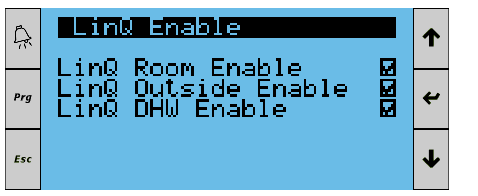

# Qube Heat Pump Wiki

## Table of Contents
1. [Computed & Derived Entities](#computed--derived-entities)
2. [Dashboard Controls](#dashboard-controls)
3. [Error Handling & Recovery](#error-handling--recovery)
4. [Diagnostics Toolkit](#diagnostics-toolkit)
5. [Multi-Hub Behaviour](#multi-hub-behaviour)

---

## Computed & Derived Entities

Beyond the raw Modbus registers, the integration exposes several helper entities that make day-to-day monitoring easier:

### Energy & Power
- **Standby vermogen** – fixed 17 W standby power reported as a sensor.
- **Standby verbruik** – integrates standby power over time (kWh) so long recordings include the “idle” cost.
- **Totaal elektrisch verbruik (incl. standby)** – combines the vendor’s total power counter with the standby integration above.
- **Elektrisch verbruik CV (maand)** – accumulates the heat pump’s electrical usage while the three-way valve is in CV mode.
- **Elektrisch verbruik SWW (maand)** – accumulates usage while the valve is in domestic hot water (SWW) mode.
- **SG Ready mode select** – exposes the consolidated `select.sgready_mode` entity. Choosing *Off*, *Block*, *Plus*, or *Max* automatically positions the underlying SG Ready A/B coils; the original coil switches remain available (but hidden) for advanced automation.
- **Stooklijn vrijgeven** – toggles the heating curve. When *On*, the pump follows the weather-compensated curve; when *Off*, it falls back to a fixed space-heating setpoint.

### Status Helpers
- **Status warmtepomp** – decodes the unit-status register to a human-readable state (Heating, Cooling, Standby, etc.).
- **Qube Driewegklep SSW/CV status** – tracks whether the three-way valve is in DHW or CV mode.
- **Qube Vierwegklep verwarmen/koelen status** – reports whether the four-way valve is set for heating or cooling.

### Diagnostic Sensors
- **Qube info** – summarises firmware version, hub label, host/IP, and total entity counts.
- **Qube connect/read errors** – incrementing counters that help identify Modbus stability issues.
- **Qube sensor/binary sensor/switch count** – live totals so you can confirm everything is still registered for the hub.
- **Qube IP address** – resolved IP in case the device is addressed by hostname.

## Dashboard Controls

The sample dashboard in `examples/dashboard_qube_overview.yaml` (and the screenshot bundled under `assets/`) surfaces the most common control entities:

- **SG Ready mode (`select.sgready_mode`)** – pick *Off*, *Block*, *Plus*, or *Max* instead of juggling the two coil switches. The integration writes the correct SG Ready A/B combination immediately; manual automations can still target the hidden coils directly if needed.
- **Stooklijn vrijgeven (`switch.en_plantsetp_compens`)** – enables the heating curve when set to *On*. Turning it *Off* drives the unit with a fixed space-heating setpoint, which is useful when you want to run on manual temperatures for troubleshooting or holiday schedules.
- **Other tiles** – demand triggers (e.g., `switch.modbus_demand`), DHW boosts, and seasonal toggles are exposed as tiles so operators do not need to dive into Modbus-specific panels. Tailor the YAML to match your entity IDs if you rename them.

## Error Handling & Recovery

- The integration uses exponential backoff on connection failures so the logs remain readable and the device isn’t hammered while offline.
- Every read has a short timeout; on failure we increment the diagnostic counters and try again next cycle.
- Entities are surfaced through Home Assistant’s `DataUpdateCoordinator`. If the pump is offline, entities report `unavailable` until Modbus connectivity returns.
- When you operate multiple hubs, the coordinator for each hub runs independently: an outage on one pump does not block updates for the others.

## Diagnostics Toolkit

Two tooling layers are available when something seems off:

### Built-in Home Assistant diagnostics
1. Go to *Settings → Devices & Services → Qube Heat Pump → ⋮ Menu → Diagnostics*.
2. Download the snapshot – it includes hub metadata, resolved IP, error counters, and entity totals.
3. Attach the file when raising issues so we can compare against known-good states.

### `modbus_probe.py`
- Located under `custom_components/qube_heatpump/`.
- Run inside the Home Assistant container for one-off register checks:
  ```bash
  python3 /config/custom_components/qube_heatpump/modbus_probe.py \
      --host 192.168.1.100 --unit 1 --address 32 --kind input --data-type float32
  ```
- Use `--word-order` / `--byte-order` to test alternative endianness and `--address` to probe off-by-one mappings.

## Multi-Hub Behaviour

- Each hub receives a persistent label (`qube1`, `qube2`, …) that you can rename under *Options*.
- Entity IDs keep their vendor-aligned slugs for a single hub. As soon as multiple hubs are installed the integration automatically appends the label (e.g. `_qube2`) so there are no collisions.
- Diagnostics entities always carry the label in both single- and multi-hub scenarios to make troubleshooting easier.
- The Options toggle **Add hub label to entity IDs** mirrors the automatic behaviour; when you enable it, labels remain appended even in single-hub environments.
- Use the **Friendly name language** selector to toggle between Dutch and English entity names. Saving the option reloads the integration automatically so the new names appear without extra steps.

### SG Ready Signals

The table below outlines how the heat pump interprets the `SG ready` inputs. Each combination of the two switches maps to a specific status and action. A one-time legionella cycle means that the anti-legionella cycle will be executed only once a day, even when SG Ready Plus or Max will be activated multiple times during the day.

| SGready A | SGready B | Status         | Action                                                                 |
|-----------|-----------|----------------|------------------------------------------------------------------------|
| Off       | Off       | SGReady Off    | No action, normal operation                                            |
| On        | Off       | SGReady Block  | Block heat pump operation                                              |
| Off       | On        | SGReady Plus   | Regular heating curve, room temperature +1 K, tapwater day mode        |
| On        | On        | SGReady Max    | Anti-legionella program once, surplus heating curve, room temperature +1 K |



When you trigger Qube demand or DHW start via the Modbus coil switches (addresses `67` and `173` exposed as `switch.modbus_demand` and `switch.tapw_timeprogram_dhwsetp_nolinq`), disable the Linq thermostat options for room temperature and domestic hot water on the heat pump controller. Leaving those Linq options enabled alongside the Modbus coils can lead to conflicting control: the coils should take ownership of those functions while activated. The `Modbus_Demand` switch is ideal for driving the heat pump from a virtual thermostat or automation—once enabled, the Linq thermostat is no longer responsible for issuing space-heating demand; your automation decides when to request heat.

To set the Modbus tapwater setpoint directly, call the integration service `qube_heatpump.write_register` and supply the DHW register address (`173`) as a float, for example:

```yaml
action: qube_heatpump.write_register
data:
  address: 173
  value: 49
  data_type: float32
```
