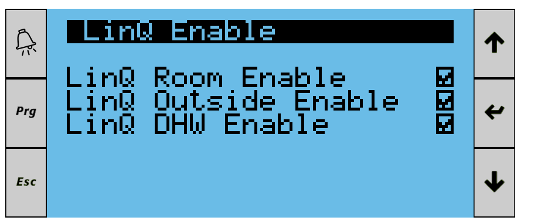

# Qube Heat Pump Wiki

## Table of Contents

1. [Supported Devices](#supported-devices)
2. [Data Updates](#data-updates)
3. [Known Limitations](#known-limitations)
4. [Entity Reference](#entity-reference)
5. [Computed & Derived Entities](#computed--derived-entities)
6. [SG Ready Signals](#sg-ready-signals)
7. [Virtual Thermostat Control](#virtual-thermostat-control)
8. [DHW Schedule](#dhw-schedule)
9. [Multi-Device Configuration](#multi-device-configuration)
10. [Use Cases](#use-cases)
11. [Dashboard Controls](#dashboard-controls)
12. [Data Integrity & Monotonic Clamping](#data-integrity--monotonic-clamping)
13. [Error Handling & Recovery](#error-handling--recovery)
14. [Security Considerations](#security-considerations)
15. [Troubleshooting](#troubleshooting)
16. [Diagnostics Toolkit](#diagnostics-toolkit)
17. [Changing the host or IP](#changing-the-host-or-ip)
18. [Removing the Integration](#removing-the-integration)
19. [Notes](#notes)

---

## Supported Devices

This integration supports [Qube](https://qube-renewables.com/) heat pumps with Modbus/TCP connectivity.

### Compatible Models

| Model | Modbus Support | Notes |
|-------|---------------|-------|
| Qube Heat Pump (all variants) | ✅ | Primary supported device |
| Qube with Linq thermostat | ✅ | Can disable Linq for HA control |

### Requirements

- Qube heat pump connected to local network via Ethernet
- Modbus/TCP enabled on the heat pump
- Network access from Home Assistant to heat pump IP (default port: 502)

### Firmware Compatibility

The integration is tested with current Qube firmware versions. If you encounter issues with a specific firmware version, please open an issue on GitHub with your firmware version and the problem description.

---

## Data Updates

### Polling Interval

The integration polls the heat pump every **15 seconds** by default (`DEFAULT_SCAN_INTERVAL` in `const.py`). This interval provides a good balance between responsiveness and network load.

The polling is handled by Home Assistant's `DataUpdateCoordinator` pattern, which:
- Polls all Modbus registers in a single coordinated update
- Handles retry logic automatically
- Makes entity state changes available simultaneously

### When Data Updates

- **On startup**: Initial data fetch when the integration loads
- **Every 15 seconds**: Regular polling interval
- **After writes**: Immediate refresh when you change a setpoint or switch

### Manual Refresh

To force an immediate data refresh:
1. Use the **Reload** button entity (`button.qube_reload`)
2. Or reload the integration from Settings → Devices & Services

---

## Known Limitations

### Technical Limitations

| Limitation | Description | Workaround |
|------------|-------------|------------|
| **Single device per entry** | Each integration entry connects to one heat pump | Add multiple entries for multiple pumps |
| **No auto-discovery** | Modbus devices cannot be auto-discovered | Manual IP configuration required |
| **Fixed register map** | Entity list is determined at setup | Reload integration if registers change |
| **Unencrypted protocol** | Modbus/TCP has no encryption | Keep heat pump on trusted network |
| **No authentication** | Modbus has no user/password | Rely on network-level access control |

### Data Limitations

| Limitation | Description | Notes |
|------------|-------------|-------|
| **Energy counter glitches** | Heat pump occasionally reports invalid energy values | Handled by monotonic clamping (see below) |
| **Electric power at idle** | Modbus register reports ~55W when pumps are in pre/post-run, while true standby is ~17W | The Qube does not measure standby consumption; 0W is reported when all pumps are off |
| **Standby excluded from totals** | `sensor.qube_power_electric` ("Total electric power (calculated)") and `sensor.qube_energy_total_electric` only count the compressor, pumps and heaters; the ~17W standby draw of the controller is not included | COP/SCOP values based on these registers are therefore slightly optimistic. Use `sensor.qube_total_energy_incl_standby` for a realistic consumption figure |
| **Compressor hold after power-on** | After a cold power-on (mains restored, controller rebooted) the controller holds the compressor off for roughly two hours while the compressor crankcase heater warms the oil; pumps may run and status may show a demand, but the compressor does not start | Normal behaviour, not a fault. Wait it out; the hold is not exposed as a register |
| **Entity ID changes** | Changing the device name changes entity IDs | Update automations/dashboards after change |
| **15-second resolution** | Data is polled every 15 seconds | Shorter changes may be missed |

### Not Supported

- Remote/cloud access (local only)
- Heat pump firmware updates
- Advanced configuration of heat pump parameters beyond exposed registers

---

## Entity Reference

Entity IDs are `<platform>.<device name>_<key>`, where the device name is slugified: the default device name **"qube 1"** gives `sensor.qube_1_temp_supply`, a device named "basement" gives `sensor.basement_temp_supply`. The key is the vendor's Modbus register key (or the computed sensor name). The device name can be changed via the integration's **Configure** dialog (field **Device name**); doing so renames every entity ID.

**Throughout this wiki `qube` stands for your slugified device name** — with the default name, read `sensor.qube_temp_supply` as `sensor.qube_1_temp_supply`.

### Sensors

The integration exposes all readable Modbus registers as sensors:

| Category | Examples |
|----------|----------|
| **Temperatures** | `sensor.qube_temp_outside`, `sensor.qube_temp_supply`, `sensor.qube_temp_return`, `sensor.qube_temp_dhw`, `sensor.qube_temp_room` |
| **Power** | `sensor.qube_power_electric`, `sensor.qube_power_thermic` |
| **Energy** | `sensor.qube_energy_total_electric`, `sensor.qube_energy_total_thermic` |
| **Setpoints** | `sensor.qube_heatsetp_1`, `sensor.qube_coolsetp_1`, `sensor.qube_dhw_setp`, `sensor.qube_regsetp` |
| **Operating hours** | `sensor.qube_workinghours_dhw_hrsret`, `sensor.qube_workinghours_heat_hrsret`, `sensor.qube_workinghours_cool_hrsret` |
| **Diagnostics** | `sensor.qube_info`, `sensor.qube_ip_address`, `sensor.qube_metric_errors_connect` |

#### DHW setpoints

The controller display distinguishes three DHW setpoints (**Min**, **User**, **Modbus**) plus the one it is actually using. The entity names follow that wording:

| Register | Entity | Name | Meaning |
|----------|--------|------|---------|
| 44 | `sensor.qube_tapw_timeprogram_dhws` | DHW setpoint (user) | The **User** setpoint on the controller display. |
| 46 | `sensor.qube_tapw_timeprogram_dhws_prog` | DHW setpoint (time program, Linq min.) | The setpoint of the controller's own time program, fed by the LinQ **Min.** value. |
| 173 | `sensor.qube_tapw_timeprogram_dhwsetp_nolinq` / `number.qube_tapw_timeprogram_dhwsetp_nolinq` | DHW setpoint (Modbus) | The **Modbus** setpoint. This is the one used by forced runs started via `switch.qube_tapw_timeprogram_bms_forced` and the only one writable from Home Assistant. |
| 47 | `sensor.qube_dhw_setp` | Active DHW setpoint | The setpoint the controller is currently regulating to (calculated). |

#### Room temperature via Modbus

`sensor.qube_modbus_roomtemp` ("Linq room temperature", register 75) is the room temperature the controller received over Modbus/LinQ. **The controller ignores this value when LinQ room control is disabled**, which is the recommended setting when Home Assistant controls heat demand (see [Virtual Thermostat Control](#virtual-thermostat-control)). In that configuration the sensor is informational only.

### Binary Sensors

| Category | Examples |
|----------|----------|
| **Alarms** | `binary_sensor.qube_glbal`, `binary_sensor.qube_usralrms`, `binary_sensor.qube_alrm_flw` |
| **Valve outputs** | `binary_sensor.qube_dout_threewayvlv_val`, `binary_sensor.qube_dout_fourwayvlv_val` |
| **Pump outputs** | `binary_sensor.qube_dout_srcpmp_val`, `binary_sensor.qube_dout_usrpmp_val` |
| **Heater outputs** | `binary_sensor.qube_dout_heaterstep1_val`, `binary_sensor.qube_dout_heaterstep2_val` |
| **Digital inputs** | `binary_sensor.qube_dewpoint`, `binary_sensor.qube_srcflw`, `binary_sensor.qube_id_demand` |
| **Status** | `binary_sensor.qube_bms_demand`, `binary_sensor.qube_surplus_pv`, `binary_sensor.qube_daynightmode` |
| **Diagnostics** | `binary_sensor.qube_alarm_sensors_active`, `binary_sensor.qube_energy_totals_stale` (on when the energy totalisers stop advancing under load, see [Troubleshooting](#energy-totals-not-advancing)), `binary_sensor.qube_thermostat_sensor_timeout` (virtual thermostat only) |

### Switches

| Entity | Description |
|--------|-------------|
| `switch.qube_modbus_demand` | Trigger heat demand |
| `switch.qube_bms_summerwinter` | Enable summer/cooling mode |
| `switch.qube_tapw_timeprogram_bms_forced` | Force DHW heating. Exposes a `pending_request` attribute: the controller keeps this coil on while a DHW request is pending, even after a turn-off has been acknowledged, and clears it itself when the run completes |
| `switch.qube_antilegionella_frcstart_ant` | Start anti-legionella cycle |
| `switch.qube_en_plantsetp_compens` | Enable heating curve |

### Number Entities

Number entities are created for the writable temperature registers:

| Entity | Description | Range |
|--------|-------------|-------|
| `number.qube_tapw_timeprogram_dhwsetp_nolinq` | DHW setpoint (Modbus), register 173 — the setpoint used by forced DHW runs | 40-65 °C |
| `number.qube_usr_pid_heatsetp` | Heating setpoint (no curve), register 101 — supply setpoint used when the heating curve is disabled | 20-65 °C |
| `number.qube_usr_pid_coolsetp` | Cooling setpoint (no curve), register 103 | 7-25 °C |

Each number entity has a read-only sensor twin with the same key (e.g. `sensor.qube_usr_pid_heatsetp`).

### Select Entity

| Entity | Options |
|--------|---------|
| `select.qube_sg_ready_mode` | Off, Block, Plus, Max |

### Buttons

| Entity | Description |
|--------|-------------|
| `button.qube_reload` | Reload the integration |
| `button.qube_clear_monotonic_cache` | Clear the energy counter cache used for monotonic clamping (see [Data Integrity](#data-integrity--monotonic-clamping)) |

---

## Computed & Derived Entities

Beyond raw Modbus registers, the integration creates several computed sensors. As everywhere in this wiki, `qube` stands for your slugified device name (`qube_1` by default).

### Energy Tracking

#### Monthly Energy Sensors

| Entity | Description |
|--------|-------------|
| `sensor.qube_standby_power` | Fixed 17W standby power |
| `sensor.qube_standby_energy` | Accumulated standby consumption (kWh) |
| `sensor.qube_total_energy_incl_standby` | Total consumption including standby |
| `sensor.qube_electric_consumption_ch_month` | Monthly CH (Central Heating) electrical consumption |
| `sensor.qube_electric_consumption_dhw_month` | Monthly DHW (Domestic Hot Water) electrical consumption |
| `sensor.qube_thermic_yield_month` | Monthly total thermal yield |
| `sensor.qube_thermic_yield_ch_month` | Monthly CH thermal yield |
| `sensor.qube_thermic_yield_dhw_month` | Monthly DHW thermal yield |

The electric totals from the heat pump (`sensor.qube_energy_total_electric`, register 69) and the calculated power (`sensor.qube_power_electric`, register 61) **exclude standby consumption**. The `standby_*` and `total_energy_incl_standby` sensors add a fixed 17W to compensate. Keep this in mind when comparing COP/SCOP figures with a utility meter.

All day/month/SCOP sensors are derived from the two totalisers (registers 69 and 71). If those stop advancing, every derived sensor freezes with them; `binary_sensor.qube_energy_totals_stale` flags that situation.

#### Daily Energy Sensors

| Entity | Description |
|--------|-------------|
| `sensor.qube_electric_consumption_day` | Daily total electrical consumption |
| `sensor.qube_electric_consumption_ch_day` | Daily CH electrical consumption |
| `sensor.qube_electric_consumption_dhw_day` | Daily DHW electrical consumption |
| `sensor.qube_thermic_yield_day` | Daily total thermal yield |
| `sensor.qube_thermic_yield_ch_day` | Daily CH thermal yield |
| `sensor.qube_thermic_yield_dhw_day` | Daily DHW thermal yield |

Daily sensors reset at midnight (local time). Use these for daily statistics and energy dashboards.

### SCOP Calculations

| Entity | Period | Scope |
|--------|--------|-------|
| `sensor.qube_scop_month` | Monthly | Total |
| `sensor.qube_scop_ch_month` | Monthly | CH only |
| `sensor.qube_scop_dhw_month` | Monthly | DHW only |
| `sensor.qube_scop_day` | Daily | Total |
| `sensor.qube_scop_ch_day` | Daily | CH only |
| `sensor.qube_scop_dhw_day` | Daily | DHW only |

SCOP values are calculated by dividing thermal yield by electrical consumption. They are *unknown* until at least 0.1 kWh of electricity has been consumed in the current cycle, and values outside the 0-10 range are reported as *unknown* rather than 0. Daily and monthly cycles reset at local midnight and on the first of the month (local time).

### Status Sensors

| Entity | Values |
|--------|--------|
| `sensor.qube_status_heatpump` | standby, alarm, keyboard_off, compressor_startup, compressor_shutdown, cooling, heating, start_fail, heating_dhw, anti_legionella |
| `sensor.qube_threeway_valve_status` | dhw, ch |
| `sensor.qube_fourway_valve_status` | heating, cooling |

---

## SG Ready Signals

The heat pump supports SG Ready signals for smart grid integration. The `select.qube_sg_ready_mode` entity provides a user-friendly interface:

| Mode | SG Ready A | SG Ready B | Behavior |
|------|------------|------------|----------|
| **Off** | Off | Off | Normal operation |
| **Block** | On | Off | Block heat pump operation |
| **Plus** | Off | On | Regular heating curve, room +1K, DHW day mode |
| **Max** | On | On | Anti-legionella once, surplus curve, room +1K |

The two underlying Modbus coils (`bms_sgready_a`, `bms_sgready_b`) are not exposed as separate switch entities; the select writes both coils together. Use the `write_register` service only if you really need per-coil control.

### Important: LinQ Dependency

SG Ready **Plus** and **Max** modes have limited effect without a LinQ thermostat:

- **Room setpoint +1°C**: Only applies when a LinQ thermostat is connected. Without LinQ, the room setpoint increase has no effect.
- **DHW day mode**: Sets DHW to day setpoint (e.g. 52°C). If your DHW temperature is already above 47°C, the Qube will not start DHW heating.

If you use SG Ready for dynamic tariff optimization (e.g. Tibber) **without LinQ**, the Plus mode may not cause the Qube to start. Consider using `switch.qube_modbus_demand` or `switch.qube_tapw_timeprogram_bms_forced` directly for more explicit control.

---

## Virtual Thermostat Control

To control the Qube from Home Assistant instead of the built-in Linq thermostat:

### Understanding Heat Demand Entities

The integration exposes two demand-related entities that serve different purposes:

| Entity | Type | Purpose |
|--------|------|---------|
| `switch.qube_modbus_demand` | Switch (writable) | Trigger heat demand via Modbus. **Only works when LinQ room control is disabled** on the Qube controller. |
| `binary_sensor.qube_bms_demand` | Binary sensor (read-only) | Shows whether heat demand is active via the BMS/LinQ input. Only reflects LinQ-initiated demand, not hardware contact demand. |

**Key points from HR Energy support:**
- `bms_demand` is for LinQ systems — it requires "warmtevraag via LinQ" to be enabled
- `modbus_demand` was created specifically for Home Assistant users — it only works when LinQ demand is **disabled**
- Hardware contact demand (hard wired thermostat) works in **parallel** with software demand — if either is active, the Qube heats
- If you have a buffer tank: even with an active demand signal, the Qube won't start if the plant temperature is already above the setpoint

### 1. Disable Linq Thermostat Options

On the heat pump controller, disable:
- Room temperature control via Linq
- DHW control via Linq



### 2. Use Modbus Demand Switch

```yaml
automation:
  - alias: "Thermostat heat demand"
    trigger:
      - platform: state
        entity_id: climate.your_thermostat
        attribute: hvac_action
        to: "heating"
    action:
      - service: switch.turn_on
        entity_id: switch.qube_modbus_demand

  - alias: "Thermostat demand off"
    trigger:
      - platform: state
        entity_id: climate.your_thermostat
        attribute: hvac_action
        to: "idle"
    action:
      - service: switch.turn_off
        entity_id: switch.qube_modbus_demand
```

### 3. Control DHW Setpoint

Use the native number entity:

```yaml
service: number.set_value
target:
  entity_id: number.qube_tapw_timeprogram_dhwsetp_nolinq
data:
  value: 52
```

---

## DHW Schedule

The options flow (Settings → Devices & Services → Qube Heat Pump → Configure → *Enable DHW schedule*) can start a forced DHW run every day at a fixed time and stop it again.

| Option | Default | Effect |
|--------|---------|--------|
| Start time / End time | 13:00 / 15:00 | When `switch.qube_tapw_timeprogram_bms_forced` is switched on and off. |
| Use the controller's Modbus setpoint | **on** | Only the forced coil is toggled. The Modbus DHW setpoint (register 173) stays as set on the controller or via `number.qube_tapw_timeprogram_dhwsetp_nolinq`. |
| DHW setpoint | 50°C | Only used when the option above is **off**: the schedule writes this value to register 173 right before switching the forced coil on. |

Before version 2026.9.1 the schedule always wrote its setpoint, silently overriding whatever was configured on the controller. Existing installations keep their stored setpoint value, but it is no longer written unless you turn the controller-setpoint option off.

### Schedule visibility

| Entity | Shows |
|--------|-------|
| `binary_sensor.qube_dhw_schedule` | **on** while the schedule option is enabled. Attributes: `start`, `end`, `setpoint_source` (`controller` or `fixed`), `fixed_setpoint` (only for `fixed`), `window_active`, `last_start`, `last_end`. The icon switches from a calendar to a water boiler while the daily window is active. |
| `sensor.qube_dhw_schedule_next_start` | Timestamp of the next scheduled start; *unknown* while the schedule is off. |
| `switch.qube_dhw_schedule_enabled` | Configuration switch that turns the schedule option on or off without opening the options dialog. Flipping it reloads the integration (a few seconds of *unavailable* entities). |

Both are diagnostic entities, involve no Modbus traffic, and update the moment the scheduler fires. The startup log line `DHW schedule enabled HH:MM-HH:MM, setpoint source: …` (or `DHW schedule disabled`) confirms what the scheduler loaded. `window_active` describes the configured time window; whether the heat pump is actually running a forced DHW cycle is shown by `switch.qube_tapw_timeprogram_bms_forced`.

---

## Multi-Device Configuration

Each heat pump is a separate integration entry with its own device name, and every entity ID is prefixed with the slugified device name. Give each entry a distinct name and the entity IDs never collide.

### Changing the Device Name

1. Go to **Settings → Devices & Services → Integrations**
2. Find your Qube Heat Pump entry and click **Configure**
3. Change the **Device name** (e.g., "basement", "main")
4. The integration reloads and renames all entity IDs to the new prefix; update automations and dashboards afterwards

### Example Entity IDs

| Heat Pump 1 ("qube 1", default) | Heat Pump 2 ("basement") |
|---------------------|------------------------|
| `sensor.qube_1_temp_outside` | `sensor.basement_temp_outside` |
| `switch.qube_1_modbus_demand` | `switch.basement_modbus_demand` |
| `sensor.qube_1_scop_day` | `sensor.basement_scop_day` |

---

## Use Cases

### Energy Monitoring Dashboard

Track your heat pump's energy efficiency over time:

```yaml
# Example energy dashboard card
type: statistics-graph
title: Monthly Energy & Performance
entities:
  - sensor.qube_electric_consumption_ch_month
  - sensor.qube_electric_consumption_dhw_month
  - sensor.qube_thermic_yield_month
stat_types:
  - sum
period:
  calendar:
    period: month
```

### Smart Grid Integration

Use SG Ready signals to optimize energy consumption based on electricity prices:

```yaml
automation:
  - alias: "Cheap electricity - boost heat pump"
    trigger:
      - platform: numeric_state
        entity_id: sensor.electricity_price
        below: 0.10
    action:
      - service: select.select_option
        target:
          entity_id: select.qube_sg_ready_mode
        data:
          option: "Plus"

  - alias: "Expensive electricity - reduce heat pump"
    trigger:
      - platform: numeric_state
        entity_id: sensor.electricity_price
        above: 0.30
    action:
      - service: select.select_option
        target:
          entity_id: select.qube_sg_ready_mode
        data:
          option: "Off"
```

### PV Surplus Heating

Combine with solar production to heat water when excess solar power is available:

```yaml
automation:
  - alias: "PV surplus - heat DHW"
    trigger:
      - platform: numeric_state
        entity_id: sensor.solar_power
        above: 1500  # 1.5kW surplus
        for:
          minutes: 5
    condition:
      - condition: numeric_state
        entity_id: sensor.qube_temp_dhw
        below: 55
    action:
      - service: switch.turn_on
        entity_id: switch.qube_tapw_timeprogram_bms_forced

  - alias: "PV surplus ended - stop DHW boost"
    trigger:
      - platform: numeric_state
        entity_id: sensor.solar_power
        below: 500
        for:
          minutes: 10
    action:
      - service: switch.turn_off
        entity_id: switch.qube_tapw_timeprogram_bms_forced
```

### Alarm Notifications

Get notified when the heat pump reports an alarm:

```yaml
automation:
  - alias: "Heat pump alarm notification"
    trigger:
      - platform: state
        entity_id: binary_sensor.qube_glbal
        to: "on"
    action:
      - service: notify.mobile_app
        data:
          title: "Heat Pump Alarm"
          message: "The Qube heat pump has reported an alarm. Check the status."
          data:
            priority: high
```

### Performance Tracking

Monitor SCOP (Seasonal Coefficient of Performance) trends:

```yaml
# Create a template sensor for SCOP status
template:
  - sensor:
      - name: "Heat Pump Efficiency Status"
        state: >
          
          
            Excellent
          
            Good
          
            Fair
          
            Poor
          
```

---

## Dashboard Controls

The sample dashboard in `examples/dashboard_qube_overview.yaml` includes:

- **System snapshot** - Picture elements with temperature overlays
- **Controls** - Switches for summer mode, DHW boost, heating curve, SG Ready
- **Demand status** - Heat demand and PV surplus indicators
- **Alarm panel** - Filtered view showing only active alarms
- **Operating hours** - DHW, heating, cooling, heater run times
- **Temperature tiles** - All temperature sensors and setpoints
- **Power & energy** - Current power and accumulated consumption
- **Performance** - Compressor speed, flow, COP, status
- **Diagnostics** - Integration info and error counters

---

## Data Integrity & Monotonic Clamping

The Qube heat pump occasionally reports glitched values for energy counters - values that are lower than the previously reported total. For `total_increasing` sensors, this would corrupt Home Assistant's energy statistics.

The integration implements **monotonic clamping** with reset detection (library 1.14.0+):

1. For each `total_increasing` sensor the last valid value is cached (in memory and in `.storage/qube_heatpump_monotonic_<entry_id>` so it survives restarts)
2. A new value slightly below the cached one (less than 1 kWh, or 1 unit for other counters) is treated as float32 jitter or a glitch and the cached value is kept
3. A value **more than 1 unit below** the cached one is a *counter reset candidate*. It is still clamped until it has been seen on 3 consecutive polls (about 45 s); then it is accepted as the new baseline and a warning `Counter reset detected for <key>` is logged
4. A single glitched zero read therefore never drops a counter, while a real reset on the controller (or a firmware hiccup that lowers the totals) no longer freezes the Home Assistant totals forever

This applies to:
- All sensors with `state_class: total_increasing`
- Working hours counters (`workinghours_*`)
- Energy accumulation sensors (`energy_total_electric`, `energy_total_thermic`)

**Clearing the cache manually**: press `button.qube_clear_monotonic_cache` ("Clear energy counter cache"). The cached maximums are forgotten in memory and on disk and the next poll is accepted as-is. Use it after you deliberately reset counters on the controller, or when a total is stuck at a clamped value.

To view clamping events, enable debug logging:

```yaml
logger:
  logs:
    custom_components.qube_heatpump.coordinator: debug
    python_qube_heatpump: debug
```

---

## Error Handling & Recovery

- **Exponential backoff** - Connection failures use exponential backoff to prevent log spam
- **Graceful degradation** - Read failures increment counters; entities show `unavailable` until recovery
- **Coordinator pattern** - `DataUpdateCoordinator` handles polling, retries, and state updates
- **Connection persistence** - The Modbus connection is maintained between polls when possible

---

## Security Considerations

### Network Security

Modbus/TCP is an **unencrypted protocol** with no authentication. The integration assumes:

- The heat pump is on a trusted local network
- Network-level access control (firewall, VLAN) is in place if needed
- No sensitive data beyond operational parameters is transmitted

### Write Access

The integration provides two ways to write values:

1. **Entity actions (recommended)** - Use `number.set_value` for setpoints, `switch.turn_on/off` for controls
2. **write_register service (advanced)** - Raw register writes for debugging or custom automations

The `write_register` service can write to any Modbus register. Only use it if you understand the register map.

### No External Connections

All communication is local:
- Direct Modbus/TCP to heat pump IP
- No cloud services or external APIs
- No data leaves your network

---

## Troubleshooting

### Common Issues

#### Cannot Connect to Heat Pump

**Symptoms**: Integration fails to load, entities show "unavailable"

**Solutions**:
1. **Verify network connectivity**
   ```bash
   ping <heat-pump-ip>
   ```
2. **Check Modbus port is open**
   ```bash
   nc -zv <heat-pump-ip> 502
   ```
3. **Verify heat pump has Modbus enabled** - Check heat pump controller settings
4. **Check firewall rules** - Ensure Home Assistant can reach port 502

#### Entities Show "Unknown" or "Unavailable"

**Symptoms**: Some or all entities show unknown/unavailable state

**Solutions**:
1. Check the `sensor.qube_metric_errors_read` for read error count
2. Enable debug logging to see detailed error messages:
   ```yaml
   logger:
     logs:
       custom_components.qube_heatpump: debug
   ```
3. Try reloading the integration (Settings → Devices & Services → Qube Heat Pump → Reload)

#### Energy Values Jump or Reset

**Symptoms**: Energy statistics show unexpected jumps or resets

**Explanation**: The heat pump occasionally reports glitched values. The integration uses monotonic clamping to filter these; a drop of more than 1 kWh that persists for three polls is accepted as a genuine counter reset (see [Data Integrity](#data-integrity--monotonic-clamping)).

**Solutions**:
1. Check the log for `Counter reset detected` warnings
2. If a total is stuck at an old (clamped) value, press `button.qube_clear_monotonic_cache`
3. If values are genuinely wrong, use Home Assistant's statistics adjustment tool

#### Energy Totals Not Advancing

**Symptoms**: `binary_sensor.qube_energy_totals_stale` is **on**; daily/monthly energy and SCOP sensors stop changing although the heat pump is running

**Explanation**: The coordinator flags this when neither `sensor.qube_energy_total_electric` (register 69) nor `sensor.qube_energy_total_thermic` (register 71) has changed for 15 minutes while `sensor.qube_power_electric` stays above 300 W. All derived day/month/SCOP sensors depend on those two totals, so they are stale as well. Seen in the field after a controller firmware hiccup.

**Solutions**:
1. Check whether the totals on the controller display are advancing. If they are, the Modbus values are stuck: try a reload of the integration, then a controller restart
2. If the totals on the display are stuck as well, contact HR Energy support
3. If the totals resumed at a lower value, press `button.qube_clear_monotonic_cache` so the new baseline is accepted immediately

#### Compressor Does Not Start After Power-On

**Symptoms**: After mains power was restored, pumps run and there is heat demand, but the compressor stays off for up to two hours

**Explanation**: This is the controller's cold-start protection: the compressor is held off while the crankcase heater warms the oil. It is not exposed as a register or alarm.

**Solutions**: None needed; the compressor starts by itself after roughly two hours.

#### Duplicate Entities After Upgrade

**Symptoms**: After upgrading from an older HACS version (pre-2026.1.5), you see duplicate entities or entities with incorrect names.

**Solutions**:
1. Try the **Recreate entities** function: click the three-dot menu on the integration → Recreate entities
2. If that doesn't resolve it: remove the integration completely and re-add it
3. Note: SCOP and utility meter sensors will start from 0 after a fresh install, as they need to accumulate data first

#### Automations Not Triggering

**Symptoms**: Automations based on heat pump entities don't trigger

**Solutions**:
1. Verify entity IDs haven't changed (check Developer Tools → States)
2. Check entity state history to confirm state changes
3. For multi-device setups, ensure the entity ID uses the right device-name prefix

#### Slow Response to Commands

**Symptoms**: Switches/setpoints take time to reflect changes

**Explanation**: The 15-second polling interval means changes may take up to 15 seconds to appear.

**Solutions**:
1. Commands trigger an immediate refresh, so delays should be minimal
2. For critical timing, consider checking entity state before proceeding

### Debug Logging

Enable detailed logging for troubleshooting:

```yaml
logger:
  logs:
    custom_components.qube_heatpump: debug
    custom_components.qube_heatpump.hub: debug
    custom_components.qube_heatpump.coordinator: debug
```

### Getting Help

1. **Download diagnostics** - Settings → Devices & Services → Qube Heat Pump → Download diagnostics
2. **Check GitHub issues** - Search for similar issues at [GitHub Issues](https://github.com/MattieGit/qube_heatpump/issues)
3. **Open a new issue** - Include diagnostics file, debug logs, and problem description

---

## Diagnostics Toolkit

### Built-in Diagnostics

1. Go to **Settings → Devices & Services → Qube Heat Pump**
2. Click the three-dot menu → **Download diagnostics**
3. The JSON file includes:
   - The config entry data and options (host, port and IP redacted)
   - The heat pump firmware version
   - Hub information: label, multi-device flag, connect and read error counters
   - The full entity list (name, unique_id, platform, register address)
   - The current coordinator data (the last values read from every register)

---

## Changing the host or IP

Use **Reconfigure** (or the host field in the options dialog). Since 2026.9.4 the device and its entities are keyed on the config entry rather than on the host, so a host change keeps the device, its area, custom names, disabled entities and long-term statistics. Installs from before 2026.9.4 are migrated automatically on first start; entity ids do not change. Downgrading to an older release afterwards is not supported.

## Removing the Integration

1. Go to **Settings → Devices & Services → Qube Heat Pump**
2. Open the three-dot menu of the entry and choose **Delete**

Home Assistant removes the device and all its entities. The `group.qube_alarms_<device name>` helper group that the integration maintains is removed when the entry unloads.

The monotonic-clamping cache in `.storage/qube_heatpump_monotonic_<entry_id>` is deleted together with the entry, so nothing is left behind. To clear the cached counter maximums *without* removing the integration (for example after a deliberate counter reset on the controller), press `button.qube_clear_monotonic_cache` instead.

---

## Notes

### DHW (Hot Water) Control

#### Setting the DHW Temperature

Use the native number entity to set the DHW setpoint:

```yaml
service: number.set_value
target:
  entity_id: number.qube_tapw_timeprogram_dhwsetp_nolinq
data:
  value: 52
```

#### Activating DHW Heating Manually

To manually start DHW heating via `switch.qube_tapw_timeprogram_bms_forced`:

1. **Set the DHW setpoint first** using `number.qube_tapw_timeprogram_dhwsetp_nolinq` — the Qube uses this setpoint, **not** the LinQ thermostat setpoint
2. The Qube will only start DHW heating when the current DHW temperature is below the setpoint minus 5°C hysteresis (e.g., below 47°C for a 52°C setpoint)
3. Once started, DHW heating continues until the setpoint is reached and cannot be stopped mid-cycle
4. Turning the switch off while a request is pending is acknowledged by the controller, but the coil **stays on** until the run completes and then clears by itself. The switch shows the coil's real state and sets its `pending_request` attribute to `true` in the meantime

### Entity ID Naming Convention

All entity IDs follow this pattern:
- Prefix: the slugified device name, set in the config or options flow (default "qube 1" → `qube_1`)
- Base: Vendor-defined key from the Modbus register (e.g., `temp_supply`, `bms_summerwinter`), or the computed sensor name

This aligns entity IDs with the vendor's Modbus documentation for easy cross-referencing.

### Terminology

- **CH** = Central Heating (formerly "CV" in Dutch)
- **DHW** = Domestic Hot Water (formerly "SWW" in Dutch)
